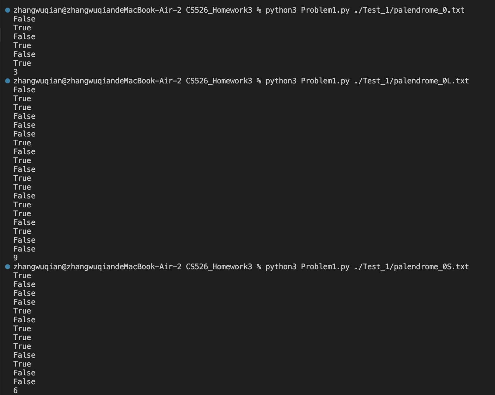
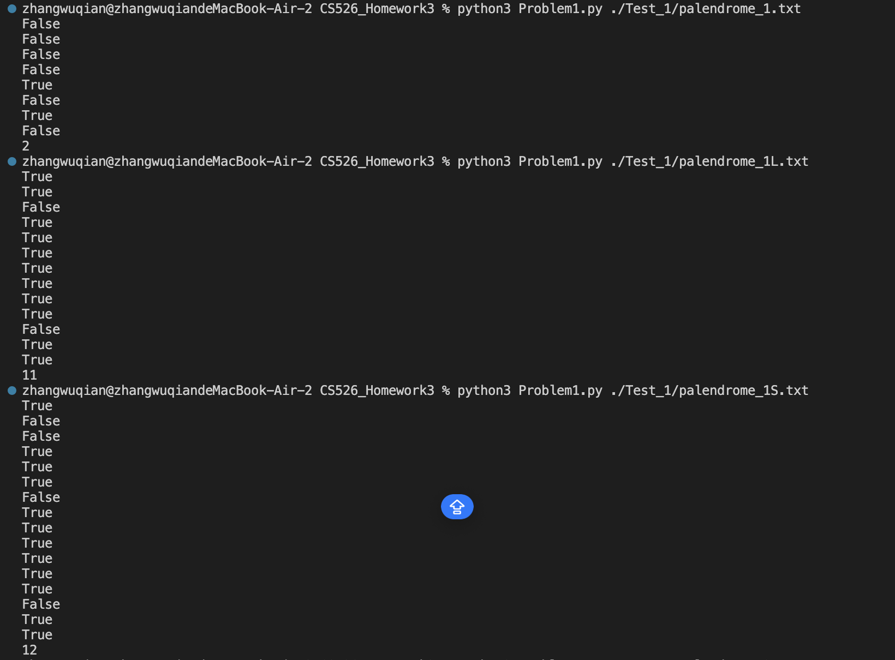
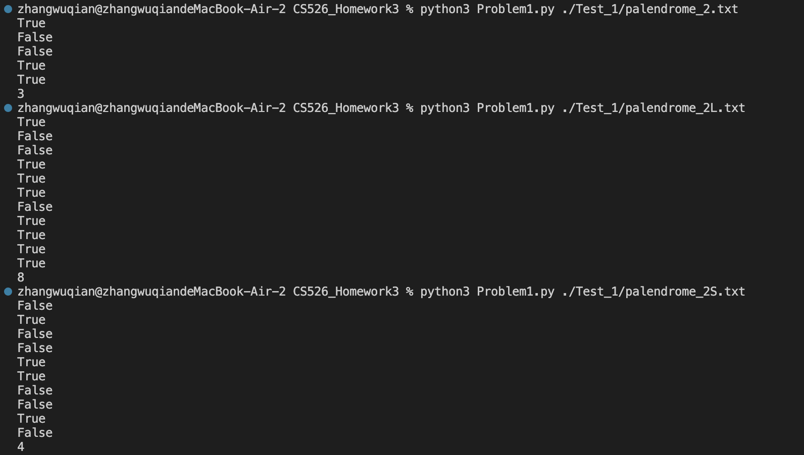
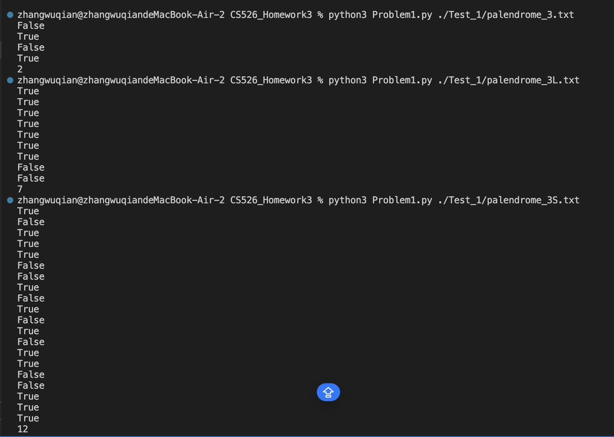
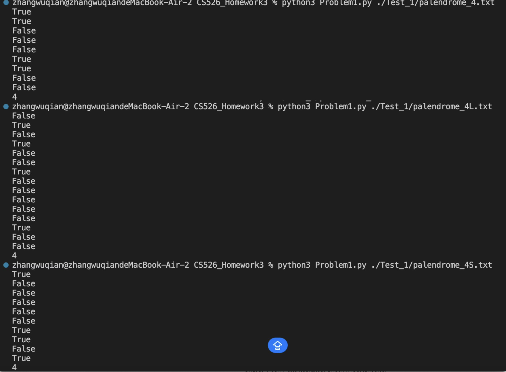
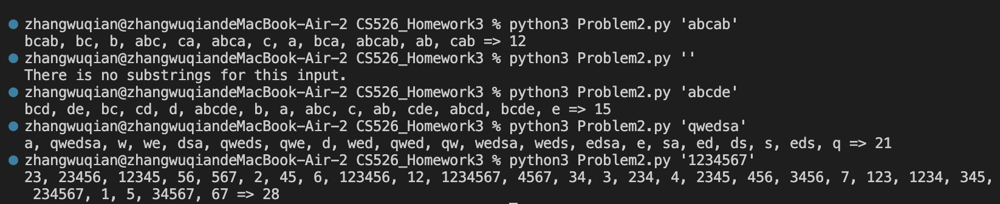
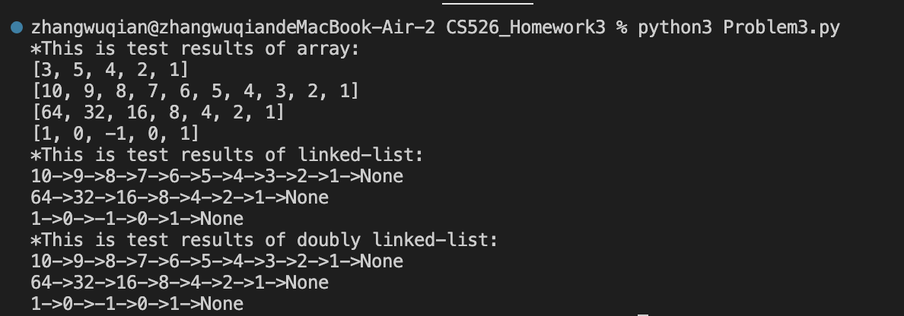
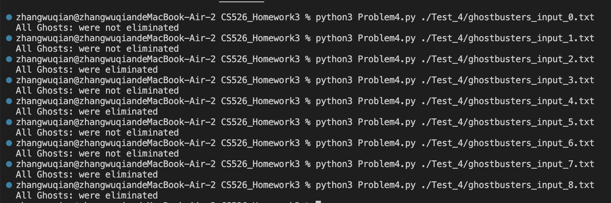

**Homework 3**

**Problem 1**:
The answer for this problem is in Problem1.py. The python file contains two functions.  
***isPalindrome()***: checks whether a single word is a palindrome by recursively comparing the first and last letters of the word. If they match, the function recurses on the inner substring, and stops with True when length is 1 or 0 or with False on a mismatch. This
function is the **heart** of the algorithm.  
***checkPalindrome()***: reads the input file, applies isPalindrome() to each line of file, outputs True or False in each line, and appends a final line with the total count of True results.  

**How to Run the code**: ENTER ***python3 Problem1.py ./Test_1/[filename]*** in the console  
`example: python3 Problem1.py ./Test_1/palendrome_0.txt`  

**Test results**:

**Problem 2**:
The answer for this problem is in Problem2.py.  
**The heart of the algorithm**(***printSubstring()***):  
This program traverses the characters of the input string, counts the substring with the initials of the traversal, and adds them to the set to remove the potentially duplicate substrings.  
The base case of the recursive function is the string is empty. If the substring set is also empty, the input string is an empty one. Otherwise, print all substrings with the count.  
For recursive steps, the function goes over each character in the string and adds the substring that starts with this letter to the set. The set can avoid the risk of duplicate substrings.  

**How to Run the code**: ENTER ***python3 Problem2.py ‘(sample string)’***  
Sample inputs:  `python3 Problem2.py 'abcab'` => printSubstring('abcab')  
                `python3 Problem2.py ''` => printSubstring('')  
                `python3 Problem2.py 'abcde'` => printSubstring('abcde')  
                `python3 Problem2.py 'qwedsa'` => printSubstring('qwedsa')  
                `python3 Problem2.py '1234567'` => printSubstring('1234567')  

**Test results**:

**Problem 3**:
The answer for this problem is in Problem3.py.  
**The heart of the algorithm**(***array***):  
This program creates a stack to store the elements poped from the array, and finally returns the stack.
Base case: Return the stack when temporary array is empty.  
Recursive steps: Every time the function pops the last element in the current array and pushes to the stack, and then recursively deal with the sub-array after removing the last element.  

**The heart of the algorithm**(***linked-list***):  
This program first specified the new head node, and then traverses the node in reverse order and makes it connected to the new head.  
Base case: When the head node is none or the next node of head is none, return head.  
Recursive steps: The *reverseLinkedList()* function go down the list until it reaches the tail node and return it as the new head. Then, during the return phase of recursion, for each level it sets the next node to point back to the current node, which means move the current head behind its next node, and breaks the old forward link by setting the current node’s next to None. Finally, it passes the new head upward until it reaches the top call.  

**The heart of the algorithm**(***doubly linked-list***):  
This program first specified the new head node, and then traverses the node in reverse order and makes it connected to the new head.  
Base case: When the head node is none or the next node of head is none, clear the previous node of head and return head.  
Recursive steps: First **reverseDLL()** reverses the sublist(doubly linked-list) starting at the current node’s next node and obtain the new head,which is similar to the linked-list algorithm. On the way back, it makes the next node point back to the current node (link next after reversing), sets the current node’s prev to that next node, and sets the current node’s next to None to break the old link.  

**How to Run the code**: ENTER ***python3 Problem3.py*** in the console  
Sample inputs:  
*Array*:  
    `array1 = [1, 2, 4, 5, 3]`  
    `array2 = [1, 2, 3, 4, 5, 6, 7, 8, 9, 10]`  
    `array3 = [1, 2, 4, 8, 16, 32, 64]`  
    `array4 = [1, 0 , -1, 0, 1]`  
*Linked-list:*  
    `linkedlist1: [1, 2, 3, 4, 5, 6, 7, 8, 9, 10]`  
    `linkedlist2: [1, 2, 4, 8, 16, 32, 64]`  
    `linkedlist3: [1, 0 , -1, 0, 1]`  
*Doubly linked-list*:  
    `doublylinkedlist1: [1, 2, 3, 4, 5, 6, 7, 8, 9, 10]`  
    `doublylinkedlist2: [1, 2, 4, 8, 16, 32, 64]`  
    `doublylinkedlist3: [1, 0 , -1, 0, 1]`  

**Test results**:

**Problem 4**:The answer for this problem is in Problem4.py.  
**The heart of the algorithm**:  
This program computes slopes of each line connected by B-G pairs. If any two different slopes appear, meaning the lines would intersect each other, return "All Ghosts: were not eliminated". If all slopes are the same but they are indeed overlapping, this condition is considered as not overlapping and returns "All Ghosts: were eliminated". Otherwise all lines are parallel, return "All Ghosts: were eliminated"  

**How to Run the code**: ENTER python3 Problem4.py ./Test_4/[filename] in the console  
example: `python3 Problem4.py ./Test_4/ghostbusters_input_0.txt`  

**Test results**:

