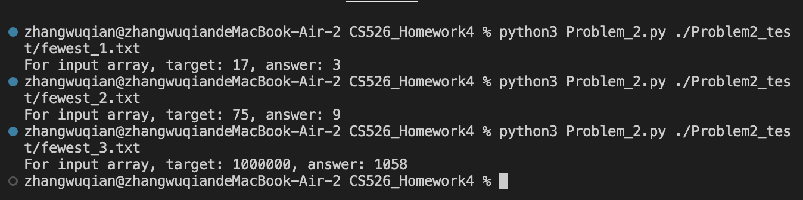
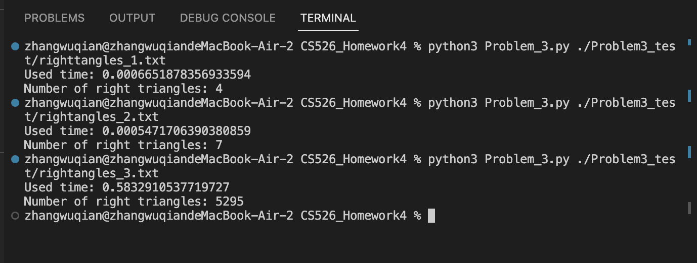

**Homework 3**  

**Problem 1**:  
*Preorder tree reversal*: A B E H F I C D G  
*Breath-first tree reversal*: A B C D E F G H I  
*Post tree reversal*: H E I F B C G D A  
*in-order tree reversal*: D G B E A C H F I  
**Problem 2**:  
**The heart of the algorithm**: Sort the array from large to small, start accumulating from the largest element, and stop accumulating once the cumulative sum exceeds T. The number of elements currently used is the answer.  
**How to Run the code**:  
ENTER `python3 Problem_2.py ./Problem2_test/[filename]`  
Samples:  
`python3 Problem_2.py ./Problem2_test/fewest_1.txt`  
`python3 Problem_2.py ./Problem2_test/fewest_2.txt`  
`python3 Problem_2.py ./Problem2_test/fewest_3.txt`  
**Test results**:  
  

**Problem 3**:  
**The heart of the algorithm**: 
For each point taken as a vertex, compute the vectors from this vertex to all other points, simplify these vectors to represent their directions. For each direction, find its perpendicular direction.  
By counting how many vectors fall into each direction and multiplying the counts of perpendicular direction pairs, we can determine how many right triangles have this vertex as the right angle.  
**How to Run the code**:  
ENTER `python3 Problem_3.py ./Problem3_test/[filename]`  
Samples:  
`python3 Problem_3.py ./Problem3_test/righttangles_1.txt`  
`python3 Problem_3.py ./Problem3_test/rightangles_2.txt`  
`python3 Problem_3.py ./Problem3_test/rightangles_3.txt`  
**Test results**:  
