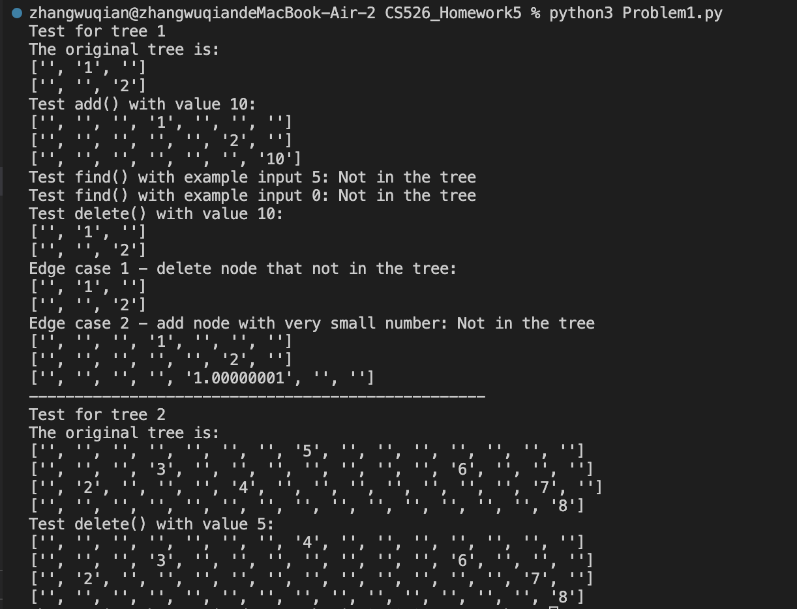

***Homework 5***  
***Problem 1***:  
*The heart of algorithm*:  
We first created the `Node` class to define the node's value and links to its left and right children. Then we defined the `BST` class to represent a binary search tree, where the tree's root is initially None. In the `add()` method, if the current tree is empty, the node becomes the root. If the tree is not empty, we start searching from the root and work downwards. If the value to be inserted is smaller than the current node's value, we move to the left subtree; if the value is greater than or equal to the current node's value, we move to the right subtree. This process continues until the correct location is found.  
In the `find()` method, we recursively compare the input node value with existing node values in the tree. If the input value is less than the node value, we search the left child; otherwise, we search the right child. If an equal match is found, we return the node. We continue this process until no match is found, at which point we return None.   
In the `delete()` method, multiple cases are considered. First, we search for the target node. If found, we examine whether it has a left child or right child. If it has no left child, we replace the deleted node's position with its right child. If it has no right child, we replace it with its left child. If both left and right children exist, we select the maximum value from the node's left subtree to replace it. We then address the original position of the deleted node by recursively calling the `delete_recursion()` method.  
In the `printTree()` method, we first use `get_height()` to determine the tree's height. `get_height()` recursively explores the subtree, and finds the height by comparing the max values of the left and right subtrees. Then, based on the height, we calculate the width and create an empty tree in array format. We position nodes within the array based on row and column coordinates. we use `2^(height - 2 - row)` to calculate the column difference between a child node and its parent node within the array. If a left child exists, we recursively assign values to the array position of the left child. If a right child exists, we recursively assign values to the array position of the right child. Finally, we call this method starting from the root node to print the entire array representing the binary search tree.  
*How to run the code*:  
ENTER `python3 Problem1.py` in the console  
*Test result*:  
  

***Problem 2***:  
*The heart of algorithm*:  
We create a dictionary called `VOWELS` that stores vowels as keys and their corresponding Morse code representations as values. Then we define a recursive function `letter_sequence()` to compute the number of possible combinations.  
We start with the base case of the recursive method `get_combinations(i)` within `letter_sequence()`, where parameter `i` represents the array index. When the base case is `arr[0]`, we take strings of lengths 1, 2, and 3 starting with `arr[0]` as the first character. If any of these strings can represent a vowel, we record `memo[(row, 0)]` as 1 in the memo; otherwise, we record it as 0. Next, we perform recursion by adding 1 to the current index number. If strings of lengths 1, 2, and 3 can represent a vowel, we look back to determine how many ways there are to represent the characters in array[0:i]. The number of ways is the sum of memo[(1,i-1)], memo[(2,i-2)], and memo[(3,i-3)]. After traversing all characters, the final answer is `memo[(1, n-1)] + memo[(2, n-2)] + memo[(3, n-3)]`.  

*How to run the code*:  
ENTER `python3 Problem2.py ./vowel_input/[filename]` in the console   
Example:  
`python3 Problem2.py ./vowel_input/vowel_input1.txt`   

*Test result*:  
  

***Problem 3***:  
*The heart of algorithm*:  
We define a helper function `set_position()` inside `longest_seq()` with two parameters, `prev_position` and `cur_turn`. The variable `prev_position` represents the index of the last selected element in the array used in the previous turn; if no element has been selected yet, its value is set to -1. The parameter `cur_turn` indicates which array (A or B) is to be processed in the current step. We use the pair `(prev_position, cur_turn)` as the key in the memoization dictionary `memo` to store previously computed results and avoid redundant calculations. When it is A’s turn, the function compares the next possible elements in array A with the value of the last chosen element from B (or negative infinity if no element has been chosen yet). For each element in A that is greater than this previous value, the function recursively switches the turn to B and continues the search. The process is similar when it is B’s turn, where the next available elements are taken from array B based on the last selected value in A.  
When the code runs for possible sequences, the recursive function iterates through the remaining elements of the current array, starting from the index immediately after `prev_position`. For each candidate element that is greater than the value chosen in the previous step, the algorithm adds one to the sequence length and calls `set_position()` recursively, switching the turn to the other array. If no valid element can be found in the current array, the function terminates the recursion.   Throughout this process, memoization ensures that each state `(prev_position, cur_turn)` is evaluated only once. The recursion begins by evaluating two possible starting points, one beginning with array A and the other with array B, and the final result is the maximum of these two computed values.  
*How to run the code*:  
ENTER `python3 Problem3.py ./longest_seq/[filename]` in the console  
Example:  
`python3 Problem3.py ./longest_seq/longest_seq1.txt`  
*Test result*:  

