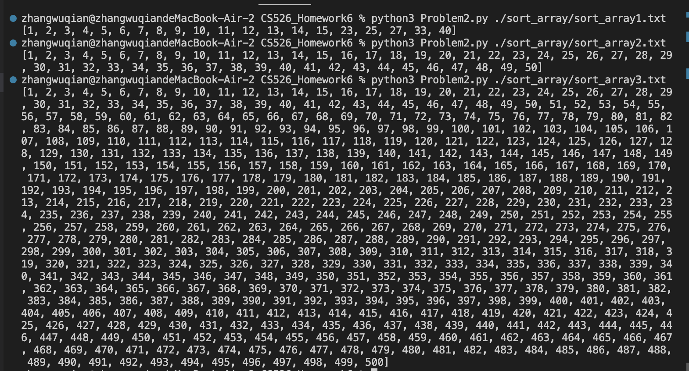

**Homework 6**  
**Problem 1**  
**Heart of the algorithm**:  
`*Merge sort*`  
We define a `mergeSort(arr)` method to split the input array into halves. After that, we recursively perform `mergeSort()` to both left and right divided parts of array. This recursion will stop when the input arr has single element. Then we return the execution result of `merge()` method with both left and right sub-arrays as input. `merge()` will compare each element in left sub-array with that in right, and return a sorted array.  
  
`*Quick sort*`  
We define a `partition()` method with argument `arr, low, high`. `low` is the index of the first element in the array(subarray), and `high` is the index of the last element. We set the last element of arr as `pivot`. `i` stands for the index of the last number in arr's sub-array that is less than the pivot number. Then, we traverse from the first to the last number in the input array excluding the pivot. If arr[j] has a value less than the pivot, we will set index `i` to `i+1` to make it point to the next position where we can place a new element smaller than pivot so we can put arr[j] in. After that, we swap arr[i] and arr[j] to put arr[j] into the correct position. After traversing all elements before the pivot, we swap the pivot number with arr[i+1] to make sure all elements before the pivot are less than it. The return number is the index of the pivot.  
We then define `quickSort()` to recursively perform `partition()` to the input array when the length of input array is at least 2. When the recursion stops, the array is sorted.  

`*Insertion sort*`  
We assume the first element in the array as the sorted sub-array, and the remaining is the unsorted one. Then we traverse the unsorted sub-array with index `i` with setting a `key` as `arr[i]`. We then use a for loop to traverse the sorted sub-array in a reverse order, comparing each element with key. If `arr[j] > key`, we move the value of arr[j] to `arr[j+1]`, and update the position of the key value. If once we meet `arr[j] <= key`, it means the sub-array with arr[j] as the last element is sorted, so we can end the loop. After the iteration that moves all elements larger than key to right, we move key value to `arr[key_position]`.  
  
**Compare and contrast**:  
*Merge sort*: The performance of merge sort is consistent, always O(nlogn), so merge sort is good at dealing with sorting arrays with large length. I would like to choose merge sort when the data amount is large.  
*Quick sort*: The performance of quick sort largely depends on the the pivot we choose. Usually the performance is O(nlogn), but if the pivot is a bad choice the performance can be O(n^2). So if the array length is not large and I want to sort faster I'd like to choose quick sort.   
*Insertion sort*: If the array is nearly sorted, the performance of insertion sort will be O(n). In regular cases the performance is O(n^2). So if the array length is small or the array is a nearly sorted array I would like to choose insertion sort.  

**How to run the code**:  
Enter `python3 Problem1.py ./sort_array/sort_array1.txt` `python3 Problem1.py ./sort_array/sort_array2.txt` `python3 Problem1.py ./sort_array/sort_array3.txt` in the console  
**Test result**:  
.png)
.png)
  
**Problem 2**
**Heart of the algorithm**:  
We define a `sort()` method that takes `arr, digit` as input to sort the array based on the value of the digit at the specified position. `radixArray` provides a set of 10 buckets that storing numbers that share the same digit at the current position, and then place them back to the output array in order. In `radixSort()`, we need to find the max number `max_num` of the array to determine how many digit positions need to be processed. The sorting proceeds from the units place digit to the most significant digit of max_num.  

**Compare and contrast**:  
Radix sort often performs in O(k n), where k represents the number of digits (or characters) of each element. If the data type in the array is integers or strings that can be split into digits, I would like to choose radix sort.  

**How to run the code**:  
Enter `python3 Problem2.py ./sort_array/sort_array1.txt` 
`python3 Problem2.py ./sort_array/sort_array2.txt` 
`python3 Problem2.py ./sort_array/sort_array3.txt` 
in the console  
**Test result**:  

  
**Problem 3**
**Heart of the algorithm**:  
The heart of this algorithm is to let all men propose to women in the order of their preferences, and women decide whether to accept or refuse according to their own preferences.  
We put all men into `unpaired_men` which represents men who have not been successfully matched so far, and create a `next_proposal` to record which woman the man will propose next time. We will choose the first man in `unpaired_men`, get his preference list from `men_pref[man]`, and send a proposal to the next woman who has not yet proposed. We plus one to `next_proposal[man]` to make sure the man in the next round will propose to the next preferred partner.  
If the woman has not temporarily matched with any man at present, she will temporarily accept the marriage proposal and mark the man as her current match. If the woman already has a temporary paired `chosen_man`, she will compare the position of the new proposed man with her current partner according to her ranking dict `women_rankings`. If she prefers the new man, she will release the originally paired man back into the `unpaired_men` and mark the new man as her current match. Otherwise, she will reject the new man, and the man will be put back in the queue and wait for the next woman to propose.  
This process will continue until all men are in a stable matching state.  

**How to run the code**:  
Enter `python3 Problem3.py ./marriage/marraige_ten.txt`
`python3 Problem3.py ./marriage/marraige_thousand.txt`
`python3 Problem3.py ./marriage/marriage_hundred.txt`
in the console  
**Test result**:  
marraige_ten.txt:  
.png)  
marriage_hundred.txt:  
_1.png)
_2.png)  
marriage_hundred.txt:  
_1.png)
_2.png)
_3.png)
_4.png)
_5.png)
_6.png)
_7.png)
_8.png)
_9.png)
_10.png)
_11.png)
_12.png)
_13.png)
_14.png)
_15.png)
_16.png)
_17.png)
_18.png)  

