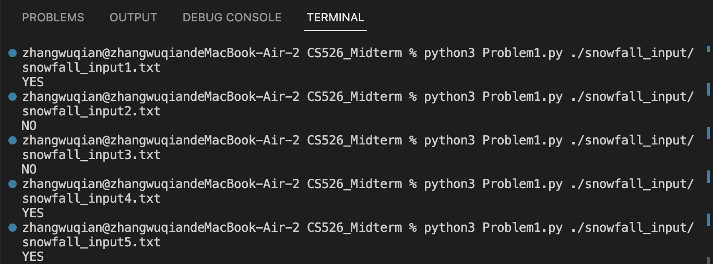
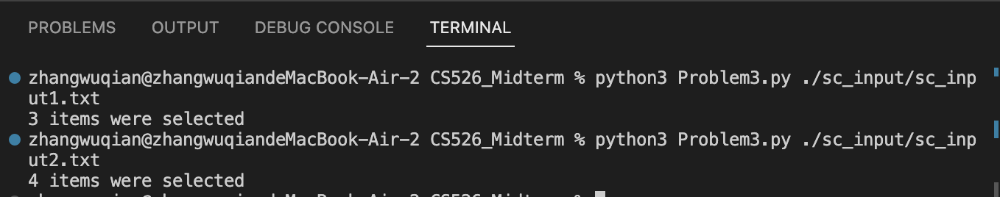
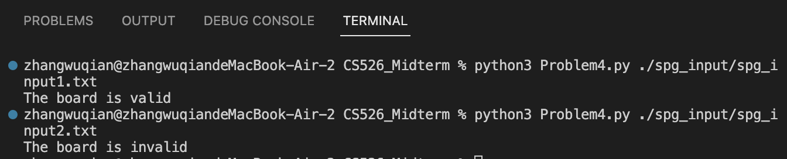

**Midterm**  

**Problem 1**:  
`Heart of the algorithm`:  
We calculate the snowfall of 3 consecutive days by subtracting the snowfall amount of the third day with the snow fall amount before the first day. We iterate such three consecutive days, use `max()` to compare each three days' snowfall amount to find the maximum snowfall, and compare the max snowfall with the half of the total snowfall.   
`How to run the code`:  
ENTER **python3 Problem1.py ./snowfall_input/[filename]**  
Example:  
python3 Problem1.py ./snowfall_input/snowfall_input1.txt  
python3 Problem1.py ./snowfall_input/snowfall_input2.txt  
...  
`Test results`:  
  

**Problem 2**:  
`Heart of the algorithm`:  
We use `set()` to store infected counties, and then recursively check if any neighboring counties between two counties are infected. If not, add them to the set and continue checking until all neighboring counties are infected and no new infected counties are added.  
`How to run the code`:  
ENTER **python3 Problem2.py ./pandemic_input/[filename].txt**  
Example:  
python3 Problem2.py ./pandemic_input/pandemic_input1.txt  
python3 Problem2.py ./pandemic_input/pandemic_input2.txt  
`Test results`:  

**Problem 3**:  
`Heart of the algorithm`:  
We define a left pointer and a right pointer to iterate the array. We store the product categories between the left and right pointers in defaultdict. If moving the right pointer results in more than two item categories in defaultdict, we consider moving the left pointer to the right. Simultaneously, after each right pointer movement while keeping the number of categories at most two, we use `max()` to compare the current number of items between the left and right pointers with the previously stored items to obtain the maximum value.  
`How to run the code`:  
ENTER **python3 Problem3.py ./sc_input/[filename]**
Example:  
python3 Problem3.py ./sc_input/sc_input1.txt  
python3 Problem3.py ./sc_input/sc_input2.txt  
`Test results`:  
  

**Problem 4**:  
`Heart of the algorithm`:  
Our main method is to iterate through the puzzle board. For this, we created lists containing `set()` methods to store the symbols traversed in the puzzle board. One list represents the symbols of each row, another list represents the symbols of each column, and we also created a matrix to represent the symbols in each sub-board. After iterating through the board, we check if the symbol value of each iterated element already exists in its current row, column, and sub-board. If it exists, the board is invalid; otherwise, we add the current symbol to the `set()` method. Finally, if there are no issues, the entire board is valid.  
`How to run the code`:  
ENTER **python3 Problem4.py ./spg_input/[filename]**  
Example:  
python3 Problem4.py ./spg_input/spg_input1.txt  
python3 Problem4.py ./spg_input/spg_input2.txt  
`Test results`:  

